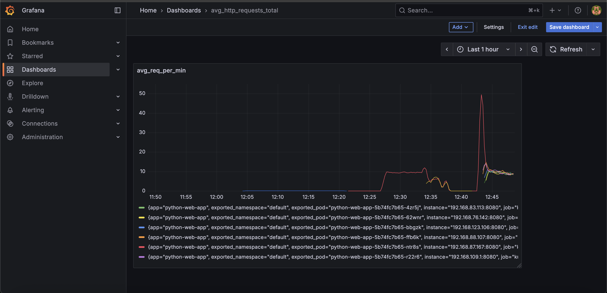
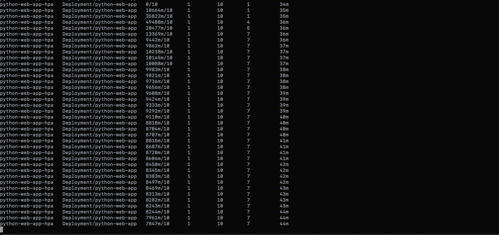

# Simple Python Web Server with Metrics to scale with HPA

## Overview
This project demonstrates Kubernetes Horizontal Pod Autoscaler (HPA) scaling based on custom metrics. A Python Flask app exposes request metrics that Prometheus scrapes, and the HPA scales pods based on requests per second.

## Local Setup
```bash
pip install -r requirements.txt
python app.py
```

## End-to-End Kubernetes Deployment

### Prerequisites
- Kubernetes cluster (EKS, kind, minikube, etc.)
- cert-manager installed:
  ```bash
  kubectl apply -f https://github.com/cert-manager/cert-manager/releases/download/v1.13.0/cert-manager.yaml
  ```
- kubectl configured
- AWS CLI configured
- Docker with buildx support

### Step 1: Build and Push to ECR
```bash
./build.sh
```
This script:
- Creates ECR repository if needed
- Builds Docker image for linux/amd64 platform
- Pushes to ECR with proper tagging

### Step 2: Deploy Complete Stack
```bash
./deploy.sh
```
This deploys:
1. **Namespaces**: `custom-metrics` and `monitoring`
2. **Python App**: Flask server with metrics endpoint
3. **Prometheus**: Metrics collection with pod discovery
4. **Prometheus Adapter**: Custom metrics API server
5. **HPA**: Autoscaler targeting 10 req/s per pod
6. **Grafana**: Dashboard for visualization
7. **RBAC**: All required permissions
8. **Certificates**: TLS certs via cert-manager

### Step 3: Verify Deployment
```bash
# Check all pods are running
kubectl get pods --all-namespaces

# Verify HPA is working
kubectl get hpa python-web-app-hpa

# Check custom metrics API
kubectl get --raw "/apis/custom.metrics.k8s.io/v1beta1" | jq .
```

### Step 4: Access Monitoring

#### Grafana Dashboard
```bash
kubectl port-forward -n monitoring svc/grafana 3000:3000
```
Visit http://localhost:3000 (admin/admin)



#### Prometheus UI
```bash
kubectl port-forward -n monitoring svc/prometheus 9090:9090
```
Visit http://localhost:9090

### Step 5: Test HPA Scaling

#### Start Load Testing (100 req/s)
```bash
kubectl apply -f k8s/stress-test.yaml
```

#### Monitor Scaling in Real-time
```bash
# Watch HPA scaling
kubectl get hpa python-web-app-hpa -w

# Watch pod count
kubectl get pods -l app=python-web-app -w

# Check metrics
kubectl top pods
```

#### Stop Load Testing
```bash
kubectl delete -f k8s/stress-test.yaml
```

### Step 6: Observe Scaling Behavior

**Expected Behavior:**
1. **Baseline**: 1 pod, ~0 req/s
2. **Load Applied**: 100 req/s from stress test
3. **HPA Triggers**: Scales to ~10 pods (100 req/s ÷ 10 req/s target)
4. **Load Removed**: Scales back down to 1 pod

**Scaling Timeline:**
- Scale-up: ~30-60 seconds
- Scale-down: ~5-10 minutes (default cooldown)



## Application Endpoints
- `GET /` - Hello World message
- `GET /health` - Health check
- `GET /api/data` - Sample data endpoint
- `GET /metrics` - Prometheus metrics (excludes itself from count)

## Architecture Components

### Core Application
- **Python Flask App**: Serves HTTP requests and exposes metrics
- **Docker Image**: Multi-arch build pushed to ECR
- **Kubernetes Deployment**: Runs app pods with resource limits

### Metrics Collection
- **Prometheus**: Scrapes `/metrics` endpoint every 30s
- **ServiceMonitor**: Configures Prometheus to discover app pods
- **Metrics Format**: `http_requests_total{pod="...",namespace="..."}` counter

### Custom Metrics API
- **Prometheus Adapter**: Converts Prometheus metrics to Kubernetes custom metrics API
- **Rate Calculation**: `rate(http_requests_total[1m])` for requests per second
- **API Registration**: Exposes `http_requests_per_second` metric to HPA

### Autoscaling
- **HPA**: Scales based on `http_requests_per_second` metric
- **Target**: 10,000m (10 requests per second) per pod
- **Range**: 1-10 pods
- **Algorithm**: Average value across all pods

### Monitoring
- **Grafana Dashboard**: Real-time visualization of metrics and scaling
- **Panels**: Request rate, total requests, pod count, HPA thresholds
- **Auto-refresh**: 5-second intervals

## Troubleshooting

### Common Issues

**HPA shows "unknown" metrics:**
```bash
# Check custom metrics API
kubectl get apiservice v1beta1.custom.metrics.k8s.io

# Check adapter logs
kubectl logs -n custom-metrics deployment/custom-metrics-apiserver
```

**Prometheus not scraping:**
```bash
# Check ServiceMonitor
kubectl get servicemonitor python-web-app-monitor

# Check Prometheus targets
kubectl port-forward -n monitoring svc/prometheus 9090:9090
# Visit http://localhost:9090/targets
```

**Certificates not ready:**
```bash
# Check cert-manager
kubectl get certificates -n custom-metrics
kubectl describe certificate cm-adapter-serving-certs -n custom-metrics
```

### Cleanup
```bash
# Quick cleanup - removes all resources
./destroy.sh
```

Or manually:
```bash
# Remove stress test
kubectl delete -f k8s/stress-test.yaml

# Remove all resources
kubectl delete namespace custom-metrics monitoring
```

## Metrics Details

**Exposed Metrics:**
- `http_requests_total`: Counter of HTTP requests (excludes /metrics endpoint)
- Labels: `pod`, `namespace`
- Format: Prometheus text format

**HPA Calculation:**
- Current: `rate(http_requests_total[1m])` averaged across pods
- Target: 10 req/s per pod
- Decision: Scale up if current > target, scale down if current < target

**Grafana Queries:**
- Request Rate: `rate(http_requests_total[1m])`
- Total Requests: `http_requests_total`
- Pod Count: `count(up{job="python-web-app-service"})`

Server runs on http://localhost:8080 (local) or port 8080 in cluster

## Visual Demonstration

### Grafana Dashboard During Load Testing
The dashboard shows real-time metrics during stress testing:


### HPA Scaling Behavior
HPA automatically scales pods based on request rate:


